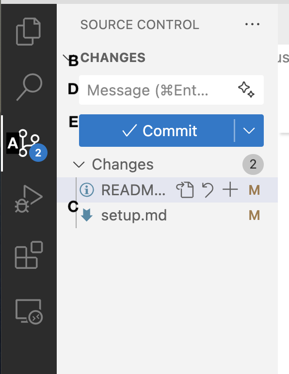
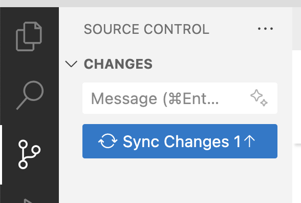

# CSIS11_Instructor

Repository for students to receive homework from the instructor.

For *CSIS11*, there are **two** repositories:
* *CSIS11_Instructor* - **this** repository, which will be the same for **all** students. It is *public* and hosted on *github.com/lkoepsel*. It contains the assignments for each week.
* *CSIS11_Student* - one repository for **each** student, it is private and hosted on *github.com/student_username*. It contains each student's work on the weekly assignments.

### Important
1. **Please make sure your version of *CSIS11_Student* on GitHub is private and is accessible by only the instructor and you.**
2. **Please do NOT make changes or add files to the *CSIS11_Instructor* repository, as this is where you will receive new versions of files from the instructor**
3. **Copy** the required files from the *Instructor* repository, each week to work on the assignments.

## Installation (UPDATED as of March 8, 2025)

If you need help moving from CSIS11_Students (*the original setup*) to CSIS11_Student (*the setup going forward*) go to [setup.md](./setup.md)

### Overview
You have two folders for your work in *CSIS1 Computer Architecures*:

* *CSIS11_Student* - your personal assignments folder where you perform the class work
* *CSIS11_Instructor* - the instructor's folder where they provide examples and assignments for the class work

This *README* file will provide instruction as to how to retrieve the weekly updates.

## Weekly Updates:

### To get the latest assignment, in the CSIS11_Instructor folder
   1. To **sync** with *lkoepsel* (or class) updates:
   ```bash
   git fetch origin
   git merge origin/main
   ```
### To push your latest assignment to your CSIS11_Student folder

#### Use VS Code:

1. Click on the Source Control icon **(A)**:
2. Note the files under Changes **(B)**, make sure they include the files you have worked on **(C)**:
3. Enter text in the *Message* **(D)** block (you must do this or VS Code will open a file for you to enter your comments and *wait...*)
4. Click *Commit* **(E)**, this will commit your files *locally*
5. Click *Sync Changes*, to push your files to your remote, **so that the instructor may see them**


**OR**

#### Your terminal program (*CLI*):
   ```bash
   # make sure you are in your CSIS11_Student folder
   git add -A # to add all of the changes
   git commit -m "adding my changes for week 5" # Commit your changes, change the message as appropriate
   git push origin # push your change to your repository on GitHub
   ```
