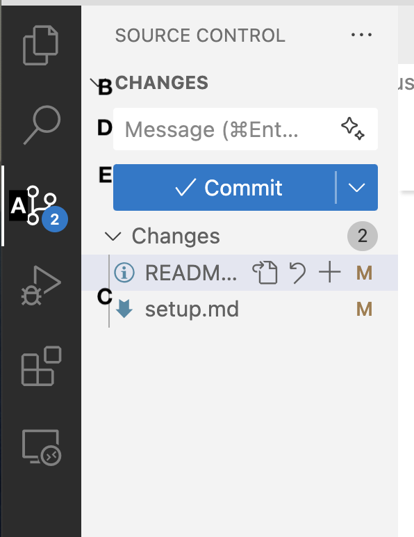
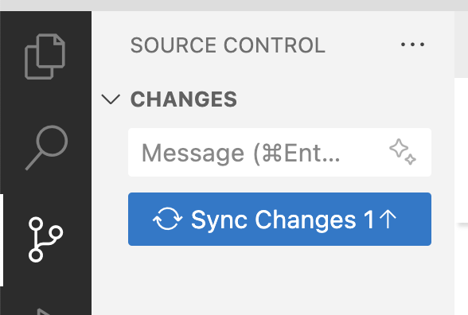
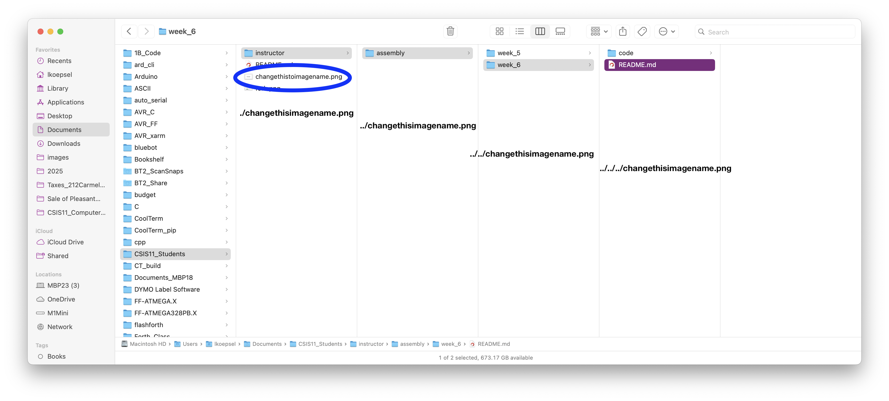

# CSIS11_Instructor

Repository for students to receive homework from the instructor.

For *CSIS11*, there are **two** repositories:
* *CSIS11_Instructor* - **this** repository, which will be the same for **all** students. It is *public* and hosted on *github.com/lkoepsel*. It contains the assignments for each week.
* *CSIS11_Student* - one repository for **each** student, it is private and hosted on *github.com/student_username*. It contains each student's work on the weekly assignments.

### Important
1. **Please make sure your version of *CSIS11_Student* on GitHub is private and is accessible by only the instructor and you.**
2. **Please do NOT make changes or add files to the *CSIS11_Instructor* repository, as this is where you will receive new versions of files from the instructor**
3. **Copy** the required files from the *Instructor* repository, each week to work on the assignments.
4. **Your folder structure must be the following:**
   * Your top folder (*Documents, below*), might be *Desktop*, *OneDrive* or something else.
      ```
      Documents/
      ├── CSIS11_Instructor/
      │   ├── assembly/
      │       ├── week_5/
      │       ├── week_6/
      │       └── ...
      │   ├── C/
      │   └── README.md
      │   └── .gitignore
      ├── CSIS11_Student/
      │   ├── assembly/
      │       ├── week_5/
      │       ├── week_6/
      │       └── ...
      │   └── C/
      │   └── README.md
      │   └── .gitignore
      ```


## Installation (UPDATED as of March 8, 2025)

If you need help moving from CSIS11_Students (*the original setup*) to CSIS11_Student (*the setup going forward*) go to [setup.md](./setup.md)

## Overview
You have two folders for your work in *CSIS1 Computer Architecures*:

* *CSIS11_Student* - your personal assignments folder where you perform the class work
* *CSIS11_Instructor* - the instructor's folder where they provide examples and assignments for the class work

This *README* file will provide instruction as to how to retrieve the weekly updates.

## Weekly Updates:

### To get the latest assignment, in the CSIS11_Instructor folder
   1. To **sync** with *lkoepsel* (or class) updates:
   ```bash
   # to download the latest
   git fetch

   # to update the contents of your local version of Instructor
   git merge

   # to view the log to ensure it matches what is on this repository
   # you will need to press q at the :, to get out of the log page
   git log
   q

   # Copy the appropriate weekly folder to your Student repository
   ```
### To push your latest assignment to your CSIS11_Student folder

#### Use VS Code:

1. Click on the Source Control icon **(A)**:
2. Note the files under Changes **(B)**, make sure they include the files you have worked on **(C)**:
3. Enter text in the *Message* **(D)** block (you must do this or VS Code will open a file for you to enter your comments and *wait...*)
4. Click *Commit* **(E)**, this will commit your files *locally*
5. Click *Sync Changes*, to push your files to your remote, **so that the instructor may see them**


**OR**

#### Your terminal program (*CLI*):
   ```bash
   # make sure you are in your CSIS11_Student folder
   git add -A # to add all of the changes
   git commit -m "adding my changes for week 5" # Commit your changes, change the message as appropriate
   git push origin # push your change to your repository on GitHub
   ```

## Style Guidelines

   **See [Example: shift_left_match](assembly/week_6/code/shift_left_match.asm)** in week_6

1. Provide program header comments, 
2. **Must include** a .ORIG directive at start of program and .END at end of program
    The *.ORIG x[address]* tells assembler to load the program starting at that address; as in *.ORIG x3000* load the program at *x3000*
2. **Lineup** labels, opcode, operands, and comments in same column for each line.
3. Use comments to explain what each register does.
4. Give explanatory comment for most instructions.
5. Use meaningful symbolic names.
6. Provide comments between program sections.

**Your grade will depend on style as well as code effectiveness**

## LC-3 Memory Map

### **System Areas** (0x0000 - 0x2FFF):

### **User Space** (0x3000 - 0xBFFF):
* **User code and stack**: x3000 - xBFFF
* Use ```.ORIG x3000``` to place your code in this space
* If you find your PC (program counter) isn't in this range, you've got a bug in your program

### **Device and I/O Areas** (0xC000 - 0xFFFF)

## LC-3 Keyboard Commands
* *Ctrl-s/Cmd-s* to Save
* *Ctrl-Return/Cmd-Return* to Build (Assemble file)

## How to Reference Images in a Markdown file

1. Use the Markdown code 
```md

```

2. Use relative addressing to locate file:

| location | prefix to filename |
| -------- | ------------------ |
| immediate folder | ./ |
| next folder up | ../ |
| two folders up | ../../ |

---




 


