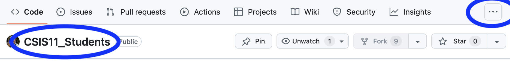

# CSIS11_Instructor

Repository for students to receive homework from the instructor.

For *CSIS11*, there are **two** repositories:
* *CSIS11_Instructor* - **this** repository, which will be the same for **all** students. It is *public* and hosted on *github.com/lkoepsel*. It contains the assignments for each week.
* *CSIS11_Student* - one repository for **each** student, it is private and hosted on *github.com/student_username*. It contains each student's work on the weekly assignments.

### Important
1. **Please make sure your version of *CSIS11_Student* on GitHub is private and is accessible by only the instructor and you.**
2. **Please do NOT make changes or add files to the *CSIS11_Instructor* repository, as this is where you will receive new versions of files from the instructor**

## Installation (UPDATED as of March 8, 2025)

### Overview
As of the start of this instruction, there are three repositories in the discussion:
1. CSIS11_Students (**Note: plural**) - this is the existing repository and will be split,
2. Into two repositories:
   1. CSIS11_Instructor - this one
   2. CSIS11_Student (**Note: singular**) - which you will create both locally and on Github to work on your assignments

### 1. Backup your current copy of CSIS11_Students on your system.
   1. **Backup: Ensure your current homework is saved and use Finder(*macOS*) / Explorer(*Windows*) to copy your CSIS11_Students to your *Desktop*. This is very important!** 
   
### 2. Delete your current version of CSIS11_Students on your Github account online.
   1. Login to *GitHub*
   2. Click on Repositories at the top then click on CSIS11_Students. (*See image below.*) Note the CSIS11_Students on the left and the "..." on the right.
   3. Click on the "..." on the right and a popup will say *Settings*, click on *Settings*.
 
   3. This will show a **long** list of items. Go to the very bottom, where it says **Danger Zone**. At the bottom of **Danger Zone** is *Delete this repository* in red.
 

   4. Follow the instructions after click on *Delete this repository*:
      1. Click on *I want to delete this repository*
      2. Click on *I have read and understand these effects.*
      3. Enter your *username/CSIS11_Students*
      4. Click on *Delete this repository*.  (*You might need to enter your credentials and the repository will be deleted.*)

### 3. Create a new CSIS11_Student repository on your system

In this step you will be making changes to CSIS11_Student**s** (*plural*), to convert it to CSIS11_Student (*singular*).

1. Delete the instructor folder
2. Change the name of CSIS11_Students (*plural*) to CSIS11_Student (*singular*)

### 4. Create a new CSIS11_Student repository on Github
1. On Github, click on Repositories.
2. Click on the new button on the far right. (*See image below.*)
 
3. In the box beside your user name enter: *CSIS11_Student*  (**Exactly!**)
 
4. Click on the green Create Repository at the bottom of the page.
 

**Do NOT close the next page shown on Github, it has your next steps!**

### 4. Connect your **local** repository to your **Github** repository.

Perform the four commands below, **one by one**, ensuring there is **NOT** an error, before going to the next step:
   1. Remove the original connection, if the result is "*error: No such remote: origin*", this is fine:
```bash
git remote remove origin
```

   2. Add the origin which will point to *your* GitHub account, so you will **need to change username**:

```bash
git remote add origin git@github.com:username/CSIS11_Student.git
```

   3. Add the branch, *main*:
```bash
git branch -M main
```

   4. Push the local branch *main* to your Github repository:
```bash
git push -u origin main
```


## Ongoing Operations:

### To get the latest assignment, in the CSIS11_Instructor folder
   1. To **sync** with *lkoepsel* (or class) updates:
   ```bash
   git fetch origin
   git merge origin/main
   ```

   2. To **update** your work on GitHub:
   - Be sure to use the week-specific folders in the ```student``` folder then commit and push to your repository using VS Code or CLI:
   ```bash
   git add -A # to add all of the changes
   git commit -m "adding my changes for week 5" # Commit your changes
   git push origin # push your change to your repository on GitHub
   ```
