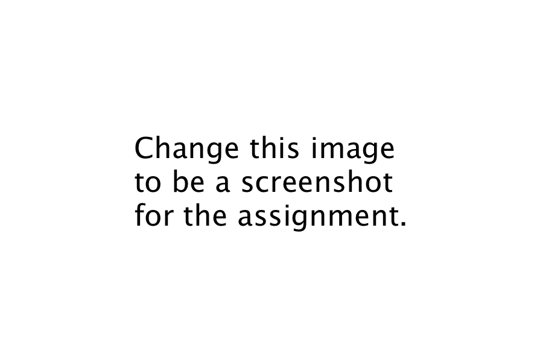
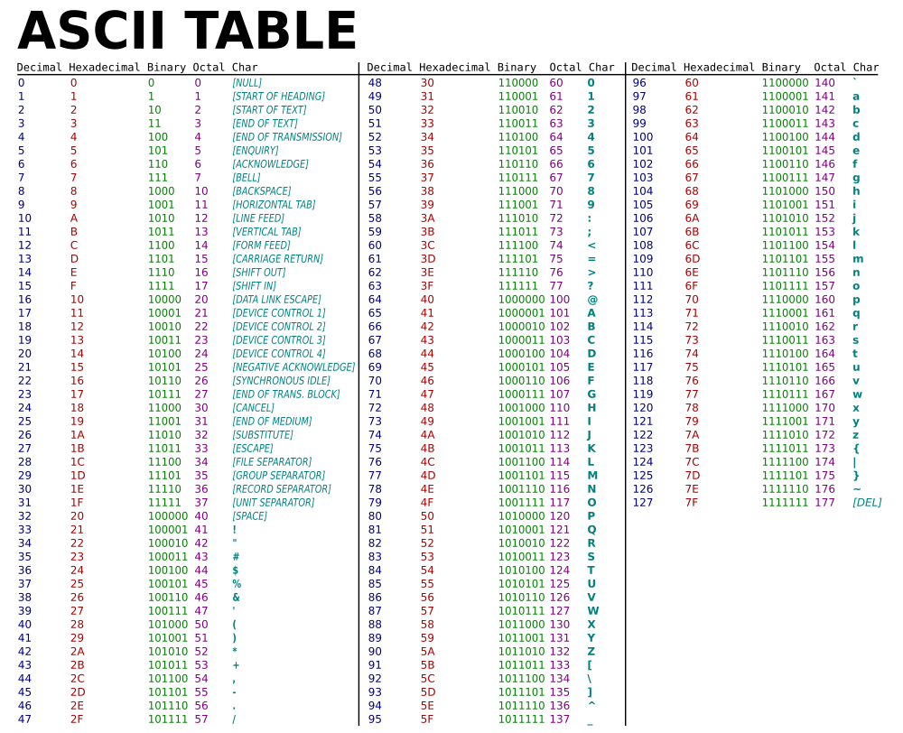

# Week 7 - Refining the Editing Process

## Instructions

1. **Copy the *week_7* folder into your *CSIS11_Student/assembly* folder.**
2. Follow the assignment by writing code or pasting images from the simulator into your *README* file.
3. If the assignment asks for a program file, place the file in the *code* folder with the assigned name
4. Once you've completed the assignment, commit and sync with your remote repository.

## Refining both your editing skills and your knowledge of LC-3 Assembly code

### Objectives
1. More intensive coding to refine your editing process
2. Using branches to add decision-making abilities
3. Using Traps for I/O in ASCII characters

### Assignments
Use *trap_branch.asm* for all of the assignments below. In some of the assignments, you will need to modify code and take a screen shot. In others, you will be simply adding code. 

1. Change the beginning headers (*TITLE* and *DESC*) to be text you want for your *Simple Math Calculator (SMC)* and take a screenshot showing the new text. You will need to run the program to have the headers display in the *console* window.

2. Determine the decimal number (0-9), from the ASCII input and store each digit in a separate memory location. Be sure to document the code.

3. Output the four digits in a row, so that it is easy to view and think of them as a 4 digit decimal number. The first digit needs to be the leftmost digit and the last digit would be the rightmost digit, just as you would right them. Run the program then capture a screenshot of the input and the output of the numbers.

4. Combine the four numbers in Step 3 into a four digit number, with the rightmost digit being a 10^0 digit, second digit from the right, 10^1 etc. Store this new decimal number in a memory location. Document the code.

**Once you have finished all four assignments, be sure to commit and sync your commits to your Github account.**

5. Use *stack.asm* for the following screenshots:

a. Uncomment the commented out error code for PUSH, lines 37-42. Run the code in the simulator and make note of the change in message as  the program ends. Take a screen shot of the LC-3 Tool to demonstrate you've run this. Be sure to return the code to original state before going forward.

b. Uncomment the commented out error code for POP, lines 51-52. Run the code in the simulator and make note of the change in message as  the program ends. Take a screen shot of the LC-3 Tool to demonstrate you've run this. Be sure to return the code to original state before going forward.

c. Add code to the stack subroutines which would allow the user to understand if they have committed a PUSH or POP error per 5a and 5b above. Consider changing the value in  R5... Update the code to perform this capability and label that program *stack_v2.asm*.

**Once you have finished these three sub-assignments, be sure to commit and sync your commits to your Github account.**

-----

ASCII-Table