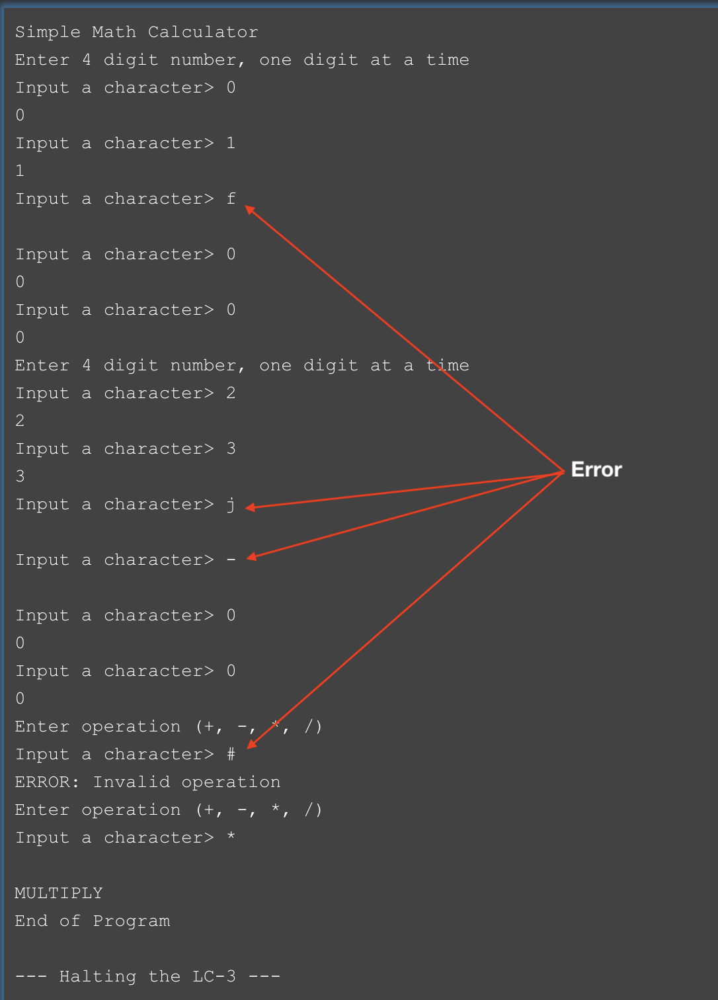

# Week 9 Assignment
This week we will wrap up our work in LC-3 Assembly Code. We will do this by completing the Simple Math Calculator.

## Simple Math Calculator (SMC) Overview
Overview - the SMC will take two values with 4 digits each and perform a math operation on them, leaving the result on the stack.
1. For each value, enter a digit, one at a time
1. For each digit entered:
    1. Assume 4 digits must be entered, as in 0012 for 12 and 1023 for 1,023
    2. Convert each digit from ASCII to an integer
    3. Multiply each digit by its appropriate 10's multiplier, as rightmost digit x1 and leftmost digit, x1000
    4. Once each digit has been multiplied, add it to a running sum of the value
    5. Once all four digits have been summed, push the value on to the stack
2. Once two values have been entered, the next character must be +, -, *, / or ignored. The characters correspond to arithmetic operations; add, subtract, multiply, and divide. 
3. Call the appropriate subroutine to calculate a result of two values on the stack and store the result, back on the stack. (*For now, I'm skipping printing the number out using ASCII, as it adds to the complexity of the problem. Final project, perhaps?)*

## Examples
### Simple Addition
Entry (one character at a time):```1000 2000 +```

It sees a "+", so it calls the PLUS subroutine which pops two numbers on the stack, adds them and stores the result on the stack. 

### Simple Addition
Entry (one character at a time):```0025 0015 *```

It sees a "*", so it calls the MULT subroutine which pops two numbers from the stack, multiplies them then stores the result on the stack. 

**NOTE:**
1) While entering a value, anything other than a numeric digit is ignored
2) While waiting for an operation token (+, - *, /), anything other than one of the four operations is ignored.

## Turn In Instructions
1. Be sure to copy this folder *week_9* to your *assembly/* folder in your repository.
2. Add your code to *code/smc.asm*, be sure it works!
3. Commit and Sync your repository, so I am able to view and grade it.

## Example Screenshots

### Plus Example


### Divide Example


### Error on Input Example

