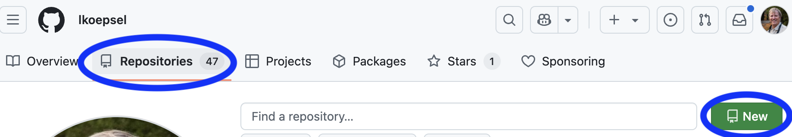
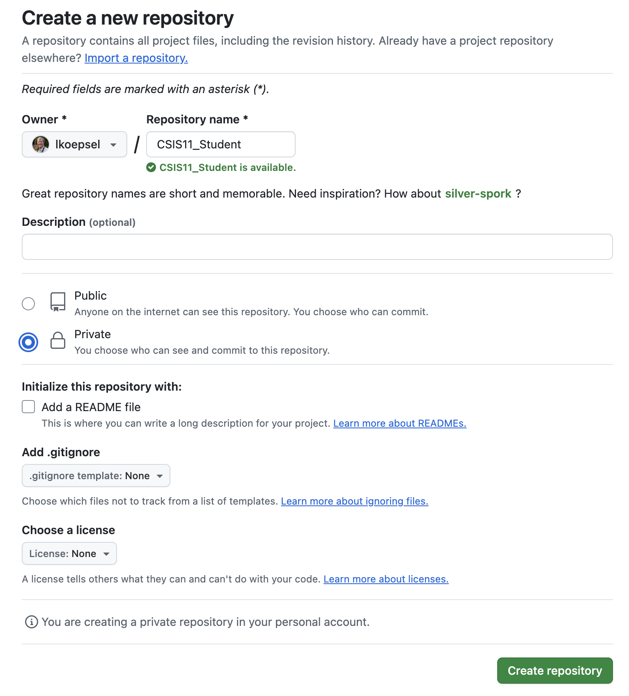

# Setup for Moving from CSIS11_Students to CSIS11_Student

## Overview
As of the start of this instruction, there are three repositories in the discussion:
1. CSIS11_Students (**Note: plural**) - this is the **existing** repository and will be ultimately deleted,
2. At the end, there will be two repositories:
   1. CSIS11_Instructor - this one
   2. CSIS11_Student (**Note: singular**) - which you will create both *locally* and *on Github* (called *remote*) to work on your assignments

## Installation Instructions
### 1. Create a new CSIS11_Student repository on your system

In this step you will create a *local* repository called CSIS11_Student (**NOTE:** *singular*). This will be the repository where you perform your assignments.

1. In either Finder(*macOS*)/Explorer(*Windows*), create a folder where you wish, called *CSIS11_Student*.
2. Open the folder in VS Code using *VS Code -> File -> Open Folder*
2. Create a new file, *Cmd-n/Ctrl-n* called README.md and paste the following contents:
```md
# README - Your name Assignments
## Assignments for CSIS11 Computer Architectures
```
Save the file, *Cmd-S/Ctrl-S*.

2. Create a new file, *Cmd-n/Ctrl-n* called *.gitignore* (**Note** *It starts with a period*) and paste the following contents:
```md
.vscode
_deps
cmake-*
build
.DS_Store
*.pdf
*.elf
*.hex
*.obj
*.o
*.d
*.eep
*.lst
*.lss
*.sym
*.map
*~
*.eeprom
env.make
~*
```
Save the file, *Cmd-S/Ctrl-S*.

3. Create two folders in the CSIS11_Student folder, one called *assembly* and the other called *C*. There are a variety of ways to do it, using the *VS Code terminal*, using *Finder/Explorer* or right-clicking in the *VS Code Explorer column*.
3. In VS Code Terminal:
```bash
git init
git add -A
git commit -m "initial commit"
git status
```
The last command will show:
```bash
git status
On branch main
nothing to commit, working tree clean
```
### 2. Create a new CSIS11_Student repository on Github
In this step, you will create a *remote* repository on Github which will be used to backup your assignments and I will use to grade your assignments.

1. On Github, click on Repositories.
2. Click on the new button on the far right. (*See image below.*)
 
3. In the box beside your user name (*mine is shown in image*) enter: *CSIS11_Student*  (**Exactly!**)
 
4. Click on Private, to ensure the repository is viewable only by you and the instructor.
4. Click on the green Create Repository at the bottom of the page. (*The entire page needs to look like the image, with the exception of the username.*)
 

### 3. Connect your local repository to your remote repository.

Perform the three commands below, **one by one**, in the *VS Code Terminal*, ensuring there is **NOT** an error, before going to the next step:
   1. Add the origin which will point to *your* GitHub account, so you will **need to change username to your Github username**:

```bash
git remote add origin git@github.com:username/CSIS11_Student.git
```

   2. Add the branch, *main*:
```bash
git branch -M main
```

   3. Push the local branch *main* to your Github repository:
```bash
git push -u origin main
```
This command will show:
```bash
Enumerating objects: 4, done.
Counting objects: 100% (4/4), done.
Delta compression using up to 12 threads
Compressing objects: 100% (4/4), done.
Writing objects: 100% (4/4), 427 bytes | 427.00 KiB/s, done.
Total 4 (delta 0), reused 0 (delta 0), pack-reused 0 (from 0)
To github.com:lkoepsel/CSIS11_Student.git
 * [new branch]      main -> main
branch 'main' set up to track 'origin/main'.
```
   4. Check your work by entering ```git status``` and the terminal will show:
```bash
git status
On branch main
Your branch is up to date with 'origin/main'.

nothing to commit, working tree clean
```

### 4. Copy your existing assignments to your new repository
1. Using *Finder/Explorer* **copy** your week_6 folder from *CSIS11_Students* (**Note:** *plural*) to *CSIS11_Student/assembly*  (**Note:** *singular*)
2. **Confirm your** *CSIS11/assembly/week_6* folder has **all** of your work.
3. **Check again on step 2**, and once you are sure, go to the next step.

### 5. Delete your local version of CSIS11_Students
   1. Using *Finder/Explorer*, delete your CSIS11_Students folder.


### 6. Clone the Instructor repository for assignments
1. Go to github.com/lkoepsel/CSIS11_Instructor
2. Click on the Green Code button and copy the address
3. In *VS Code Terminal*, navigate to where you would like to place the Instructor repository using *cd*. For example:
```bash
# go to your home folder
cd
# go to Documents
cd Documents
# confirm you are where you want to be
pwd
~/lkoepsel/Documents
# clone folder
git clone git@github.com:lkoepsel/CSIS11_Instructor.git
```

## Summary

You now have two folders for your work in *CSIS1 Computer Architecures*:

* *CSIS11_Student* - your personal assignments folder where you perform the class work
* *CSIS11_Instructor* - the instructor's folder where they provide examples and assignments for the class work

The *README* file in *CSIS11_Instructor* will provide instruction as to how to retrieve the weekly updates.